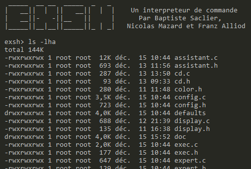
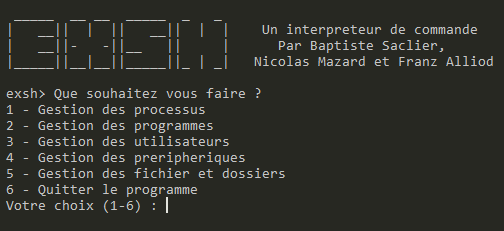
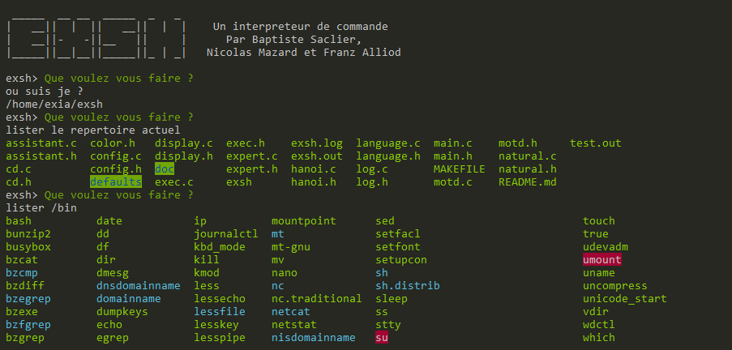
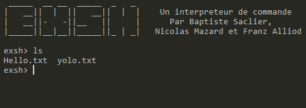

## EXSH
# Exia Shell 2.0
### Une nouvelle vision du Shell

<div class="page-break"></div>

## Introduction

Merci d'avoir choisi Exia Shell 2.0 comme shell pour votre ordinateur. Ce guide va vous présenter les fonctionalités de cet interpreteur de commandes qui vous fera changer votre vision du shell.

> Dans la suite de ce mode d'emplois le nom "Exia Shell 2.0" sera remplacé par l'abreviation EXSH

## Sommaire

1. Modes d'utilisation
    1. Mode Expert
    2. Mode Assistant
    3. Mode Naturel
2. Administration
    1. Message de bienvenue
    2. Configuration
    3. Multilangue
    4. Logging
    5. Ajouter des catégories
    6. Etoffer le mode naturel

## Modes d'utilisation

Contrairement aux autres interpreteurs de commande *EXSH* a pour vocation de faciliter au plus l'utilisation d'un shell. Pour ce faire il est composé de 3 modes permettant de l'utiliser sans connaissance des commandes. On dénombre actuellement 3 modes :

**Le mode expert** : Ce mode fonctionne comme un shell classique. L'utilisateur entre les commandes du systeme et celui ci donne un resultat. Ce mode est privilégié par les administrateurs et les personnes desirant un controle plus précis de ce qu'il se passe sur la machine.

**Le mode assistant** : Ce mode présente une suite de catégories puis de sous catégories permettant de trier les commandes de base disponibles a l'utilisateur. Celui ci peut alors naviguer dans des menus et voir un grand nombre de commandes disponibles sur la machine.

**Le mode naturel** : Destiné aux novices, ce mode permet d'ecrir en toutes lettres ce que l'on désire éfféctuer et l'interpreteur ira chercher dans une base de données, composé de fonctions de base, ce que l'utilisateur veux faire.

Vous trouvez ci-dessous un manuel d'utilisation détaillé pour chacun de ces modes.

### Mode expert

Le mode expert est déstiné aux utilisateurs expérimentés ayant déjâ eu une experiance sur un système LINUX. Dans ce mode l'interprèteur de commandes affiche un invité de commandes personnalisable (par defaut `exsh>`) qui donne la permission a l'utilisateur d'entrer une commande.
<br/>


Une commande peut etre ecrite directement si le programme qui la représente est présente dans le dossier `/bin`. Si ce n'est pas le cas il faut préciser un chemin absolu ou relatif vers le programme. Par exemple on peut ecrire `ls` mais on ne peut executer un executable dans un autre dossier en le précédent d'un `./`.

Malgres sa complexitée le mode expert permet d'opèrer de manière précise et les fonctionnalités son tres larges. Ce mode est particulièrement approprié pour les administrateurs.



### Mode assistant

Le mode assistant se présente comme un arbre de commandes. Ces catégories munis d'une décription permettent de rendre plus explicite l'execution des commandes. Dans ce mode aucune commande n'est vue par l'utilisateurs mais associés a des catégories. On se déplace dans cette archithecture de menu a l'aide de chiffres. Les fonctions de base sont regroupés dans des catégories permettant de facilement trouver la fonctionalité demandée. Le mode assistant se présente comme suit :



Ce mode permet de rechercher facilement une fonctionnalité et d'entrer chaque paramètre indépendement. Ce mode est a privilegier pour les utilisateurs désirant une utilisation avancée de la machine mais sans utiliser les commandes. Malgres tout les moyens mis en oeuvre il peut arriver que certaines commandes ne soient pas présentes et votre administrateur peut ajouter des catégories. Pour ce faire refèrez vous a la section *Administration > Ajouter des catégories*

### Mode naturel

Le mode naturel permet de rendre l'utilisation du shell aussi simple qu'une discussion entre amis. Il suffit de décrir ce que vous voulez faire en une phrase simple et le programme se charge d'en dégager des mot clef et de faire la correspondance avec des commandes connus.



Dans le mode naturel certaines regles sont a respecter. Tout les chemins vers les dossiers ou les fichiers doivent toujours être précédés par un `/` ou un `./` en fonction de l'origine.

Les phrases implémentés sont limités aux actions de base ainsi les fonctionalités actuellement présentent sont les suivantes.

|Fonctionalitée|Paramètre|
|---|---|
|Lister le dossier actuel|Aucun|
|Lister le repertoire actuel en ordre décroissant|Aucun|
|Lister un repertoire donné|Un chemin|
|Lister un repertoire donné en ordre décroissant|Un chemin|
|Afficher le repertoire actuel|Aucun|
|Creer un fichier|Un chemin|
|Creer un dossier|Un chemin|
|Editer un fichier|Un chemin|
|Supprimer un fichier|Un chemin|
|Supprimer un dossier|Un chemin|
|Afficher un fichier|Un chemin|
|Changer son mot de passe|Aucun|
|Passer en Super utilisateur|Aucun|
|Demander l'heure, la date, le jour ou l'année|Aucun|
|Lister les processus|Aucun|
|Tuer un processus|Un PID|
|Executer une commande depuis /bin|Un chemin|
|Executer un programme|Un chemin|

## Administration

EXSH est un shell pensé pour être modulable. Nos (futurs) ingénieurs ont pensés le code source pour que toutes les données ne demandant pas de programmation soit personnaliseables par l'administrateur stysteme a l'aide de fichier de configuration stockés dans `/etc/exsh`.

### Message de bienvenue

Au démarrage du shell un message de bienvenue est affiché a l'utilisateur. Ce message de bienvenue est par defaut un affichage du nom du shell et de ces créateurs mais il est possible d'en changer a l'aide des fichiers contenus dans le dossier `/etc/exsh/motd/`. Ce dossier contien des fichiers ayant pour nom le code de langue (fr/en/de/...). En fonction de la langue choisie un message de bienvenue différent s'affichera. Vous pouvez modifier ces fichier et l'ensemble de celui ci sera affiché a l'utilisateur des sa connexion.

### Configuration

Le fichier de configuration principal de EXSH est le fichier `/etc/exsh/profile`. Ce fichier contien simplement 3 lignes *Mode*,*Language* et *Prompt*.

**Mode** est le mode utilisé pour toute connexion d'utilisateur. Ce paramètre peut prendre 3 valeurs différentes.

|Valeur|Mode|
|---|---|
|0|Expert|
|1|Assistant|
|2|Naturel|

**Language** ce paramètre est la langue du shell. Ce paramètre prend pour valeur une chaine de 2 caractères représentant le code de langue. Les langues disponibles sont pour le momment :

|Code|Langue|
|---|---|
|fr|Français|
|en|Anglais|
|es|Espagnol|

**Prompt** ce paramètre prend pour valeur une chaine de caractères représentant le promp personnalisé a afficher aux utilisateurs. Ce prompt sera affiché a tout utilisateur pour lui montrer qu'il peut intéragir avec le programme. Voici un exemple de prompt `exsh>` :



### Multilangue

EXSH intègre un systeme multilangue permettant a un utilisateur de comprendre au mieux le fonctionnement do shell. Ce multilangue se base sur des fichiers contenus dans le dossier `/etc/exsh/lang`. Chacun des fichier de langue a pour nom le code de langue associé et se présente dans un système de `clé=valeur`. Vous pouvez ainsi modifier une traduction ou ajouter un nouvelle langue.

### Logging

EXSH intègre un système de logging permettant de savoir a quel date a été executé une commande. Le Fichier de log est modifié dans `/var/log/exsh.log`.

> **ATTENTION** Il est impératif de définir les droits du fichier logs pour qu'un tiers puisse le modifier sans quoi un erreur apparaitra durant l'execution.

Le fichier de log se présente ainsi :

```
[Tue Dec 15 11:05:09 2015]-/bin/ps -u
[Tue Dec 15 11:07:37 2015]-/bin/ls /bin
[Tue Dec 15 11:37:38 2015]-/bin/mount 15478 15478
[Tue Dec 15 11:46:52 2015]-hanoi
[Tue Dec 15 16:31:09 2015]-ls
[Tue Dec 15 16:43:27 2015]-exit
[Tue Dec 15 16:43:43 2015]-/bin/ps -u
[Tue Dec 15 16:44:04 2015]-/bin/pwd
[Wed Dec 16 09:09:39 2015]-ls
[Wed Dec 16 09:11:28 2015]-ls
```

### Ajouter des catégories

Le mode assistant se base sur un fichier de configuration pour créer l'arboréscence des menus. Le fichier de configuration se trouve dans `/etc/exsh/assistant`. Ce fichier utilise une syntaxe particulière pour organiser les données.

```
assistant.process
 assistant.listProcess:/bin/ps -u
 assistant.killProcess
  assistant.killProcessNumber:/bin/kill %d|assistant.param.process
  assistant.killProcessName:/usr/bin/killall %s|assistant.param.killProcessName
```

L'exemple ci dessus montre une catégorie ayant pour nom `assistant.process` et contenant 2 elements `assistant.listProcess` et `assistant.killprocess`. Les noms des catégories ne sont pas écrits tel quel mais ce sont des réfèrances au fichier de langue de l'utilisateur. On indente avec un **espace** pour organiser les données.

Pour ajouter un element a une catégorie vous devez mettre le bon nombre d'espace au debut pour préciser l'indentation puis mettre la réfèrance au fichier de langues. Si vous voulez executer une commande des que l'utilisateur selectionne l'element vous pouvez ajouter a une ligne un symbole `|` suivi de la commande executer.
Si votre commande demande des paramètres vous pouvez mettre un sige `%s` ou un signe `%d`. Vous devez ensuite mettre les refèrances aux fichier de langue séparés par de ssymboles `|`.

### Etoffer le mode naturel

Le mode naturel est par défaut assez sommaire mais il est possible de l'etoffer. Pour cela vous pouvez modifier les fichier contenus dans le dossier `/etc/exsh/natural/`. Comme a l'abitude chaque fichier est propre a une langue. On écrit une ligne du mode naturel par commandes possible.
Une ligne se décompose en 2 ou 3 parties sépares par des symboles `|`. Dans la première partie on énumère les mot clefs requis dans la phrase qui vas executer la commande. Les mots clefs entrés devrons etre tapes dans l'odre par l'utilisateur mais pourrons etre entrecoupés d'autres mots. La seconde partie est la commande a executer de manière précise. Si la commande demande des paramètre on peut ajouter un `%` dans la commande puis ecrire dans la troisième partie le type de données a entrer a la place de `%`. Les donnes possiblmes sont `directory` pour un chemin et `number` pour un nombre.

Voici un exemple de ligne qui execute la commande ls sur un chemin donné :

```
lister,dossier|/bin/ls % --color|directory
```

Cette ligne permet d'accèpter les lignes suivantes :

* lister le dossier /bin
* peux tu lister le beau dossier du chemin ./exsh ?
